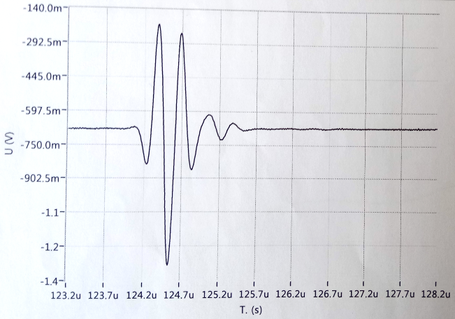

# Device characteristics

## Goal

* 15 frames per second
* 128 gray level
* 64-128 lines
* 60° sector image
* 1 mm resolution
* 3 frequencies:
* * 3.5 MHz (focal from 50 to 150 mm)
* * 5 MHz (focal from 30 to 105 mm)
* * 7.5 MHz (focal from 10 et 75 mm)

## Actually reach

* around 3 frames per second
* 128 gray level
* 64-128 lines
* 60° sector image
* 1 mm radial resolution
* lateral resolution is unknowed yet
* 1 frequency (3.5 MHz)

## Miscellaneous

The output of the high voltage circuit is around -97 V

 

Transducer characteristics:

* Pulse duration at -6 dB: 382 ns (precision of 0.56 mm)
* Acoustic pass-band: 2.13 MHz, from 2.21 to 4.33 MHz
* Focal depth: 120 mm
* Excitation time: around half the period = 142 ns
* Excitation voltage: < -150 V

## Informations

In our device number of lines, sector angle, beggining of measurement, end of measurement and amplification factor are variables.

By default we use a 60° sector, 64 lines and measure from 80 to 160 mm depth. We these settings, we have 1689 points per lines. So an image is composed of 108096 points (the sector image can be included in a rectangle 91 mm *160 mm).

The device is used as an access point and a terminal must connect to it. The device send the RAW data encoded on 16 bits *via* TCP protocol to the terminal (so an image has a size of 4.2 Mbits). The device send the data line by line (first 16 bits of the buffer give the number of the line). The device can send the data to multiple terminals at the same time.

For making an image, the terminale receive the data, for each line it determines the envelope of the signal with an Hilbert transform. When all the lines of an image are received and processed, the terminal displays the image on gray scale as a sector image.
