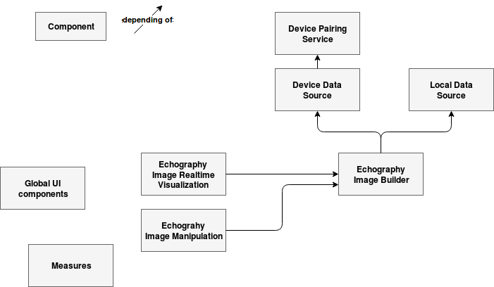

# Mobile Application functionnal Architecture
This diagram is a representation of the functionnal components of the mobile application. We will give a short description of each module role.

 

The EchOpen mobile application is divided into the following components:

 * **Device Pairing Service:** *ensures robust connection and communication to EchOpen echography device through Wifi via TCP/IP protocol*
 
 * **Device Data Source:** *receives and reads TCP/IP messages from echOpen echography device and formats information into image raw data streaming*
 * **Local Data Source:** *emulates an echOpen device. To do so it reads mobile phone local files and formats information into image raw data streaming*
 
 * **Echography Image Builder:** *transforms an image raw data sequence into a displayable bitmap image by applying on a sequence of filters(envelop detection, scan conversion, ...)*
 * **Echography Image Realtime Visualisation:** *provides realtime image streaming rendering*
 * **Echography Image Manipulation:** *allows user to manipulate on-the-fly image contrast*
 
 * **Measure:** *allows user to deposit a ruler on the image and display associated precise measure*
 
 * **Global UI components:** *handles common UI navigation elements*

# Mobile Application Class Diagram
This diagram is a representation of the mobile application implementation. It provides an overview of the Java class architecture and locates main code entry points.

 

 

To get detailed class description, please refer to [Doxygen documentation](https://github.com/echopen/PRJ-medtec_androidapp/tree/master/doc/app_javadoc)

# Current algo choice for scan-conversion

## RenderScript

The best performances are at the moment of the writing \(_07.05.17_\) are obtained with RenderScript. We achieved a performance of around 90-100 fps. however the limit is that the user don't control the allocation to GPU or CPU, and it seems that on most modern architecture, GPU is consistently used, which explains the high frame rate. In a near future, we would like to carry the scan conversion on Vulcan. For the moment \(_07.05.17_\), it is not widely supported or implemented on smartphones.

## OpenCV

To process scan conversion in our implementation, we use OpenCV. The OpenCV implementation scan conversion process is processed from the `opencv_interpolation()` in the `ScanConversion` class, under the `preproc` package.

OpenCV uses essentially the number of lines and the number of samples in order to run its scan conversion method `Imgproc.linearPolar` \(see [here](https://echopen.gitbooks.io/android-app/content/constants.html) for further informations about number of lines and of samples\).This method can be found in the `opencv_interpolation()` in the `ScanConversion` class.

We chose to use cubic interpolation, which is done by passing to method the `Imgproc.INTER_CUBIC` constant. There are many other scan conversion algorithms choice available. You'll find [here](http://www.swarthmore.edu/NatSci/mzucker1/opencv-2.4.10-docs/modules/imgproc/doc/geometric_transformations.html#cv.Resize) some of them such as `Imgproc.INTER_NEAREST` for nearest neighboor interpolation or `Imgproc.INTER_LINEAR` for bilinear interpolation

**To understand further the technological internals of the ultrasound probe, we refer the reader to our **[**start-kit**](https://echopen.gitbooks.io/starterkit/content/)** GitBook**

## Home-made scan conversion

The home made implementation scan conversion process is processed from the `compute_interpolation()` in the `ScanConversion` class, under the `preproc` package.

Contrary to the `OpenCV`  implementation, there are much more paramaters to set. See [here](https://echopen.gitbooks.io/android-app/content/constants.html) for further informations about these parameters.

## OLPC implementation

In 2007, some echOpen's team worked on an early implementation of an ultrasound probe on an [OLPC](https://fr.wikipedia.org/wiki/One_Laptop_per_Child) device. It had to be faced scan conversion issue, you'll find [her.e](http://echopen.org/index.php/Scan_Conversion) a short story of this an some technical explanation about how the problem was tackled.

